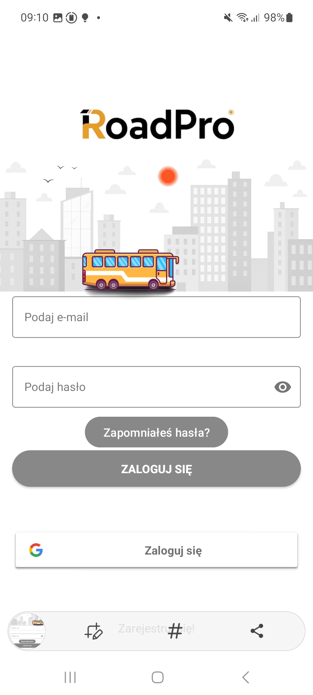
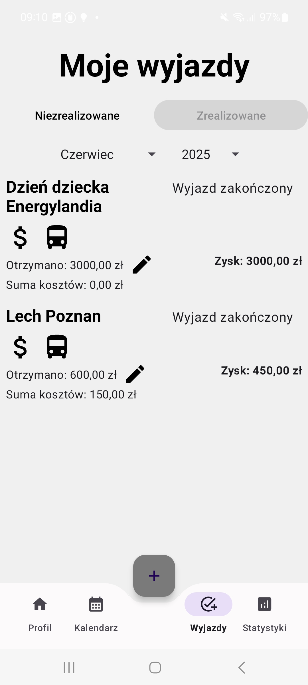
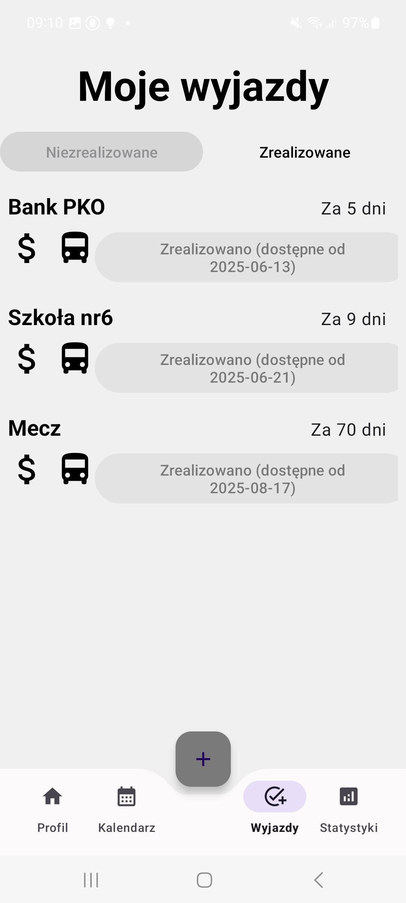
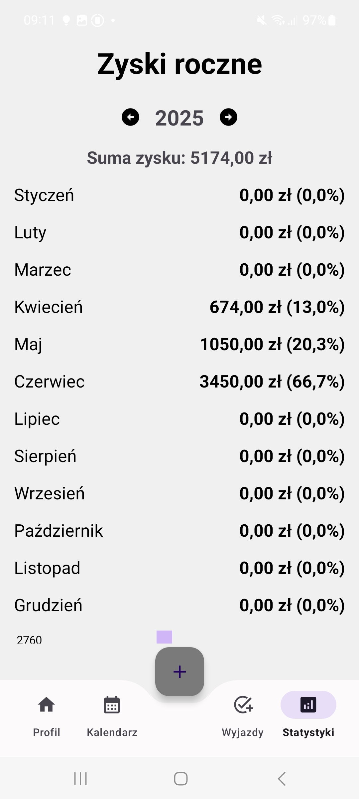
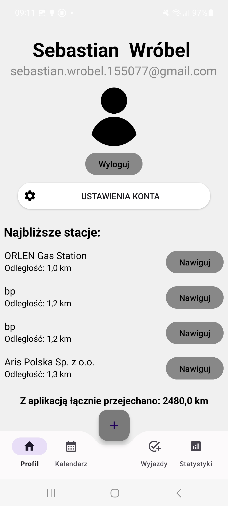

# RoadPro – aplikacja mobilna

RoadPro to aplikacja mobilna stworzona w celu zarządzania wyjazdami, wydarzeniami oraz związanymi z nimi kosztami i zyskami.  
Aplikacja pozwala użytkownikowi planować wyjazdy, zapisywać koszty oraz przychody, a także analizować statystyki finansowe.

Projekt został wykonany w technologii **Android (Kotlin)** z wykorzystaniem usług **Firebase** oraz **Google API**.

---

## Główne funkcjonalności

- logowanie użytkownika przy użyciu e-maila lub konta Google
- dodawanie i zarządzanie wyjazdami
- oznaczanie wyjazdów jako zrealizowane
- zapisywanie kosztów i przychodów z wyjazdu
- obliczanie zysku z każdego wyjazdu
- statystyki roczne zysków
- kalendarz wydarzeń
- wyświetlanie najbliższych stacji paliw w okolicy

---

## Zrzuty ekranu aplikacji

### Logowanie

### Lista wyjazdów

### Zrealizowane wyjazdy

### Statystyki roczne

### Profil użytkownika

---

## Technologie

Projekt został stworzony z wykorzystaniem następujących technologii:

- Kotlin
- Android SDK
- Firebase Authentication
- Firebase Firestore
- Google Sign-In
- Google Maps API
- Google Places API
- Material Design

---

## Instalacja

1. Sklonuj repozytorium git clone https://github.com/wrobel546/RoadPro---Mobile-App.git
2. Otwórz projekt w **Android Studio**
3. Skonfiguruj Firebase
4. Uruchom aplikację na emulatorze lub urządzeniu Android

---

## Cel projektu

Celem projektu było stworzenie aplikacji mobilnej umożliwiającej zarządzanie wyjazdami oraz monitorowanie zysków i kosztów związanych z transportem lub organizacją wydarzeń.

Projekt został wykonany jako element portfolio programistycznego oraz w celu rozwijania umiejętności programowania aplikacji mobilnych.

---

## Autor

Sebastian Wróbel  

GitHub:  
https://github.com/wrobel546
